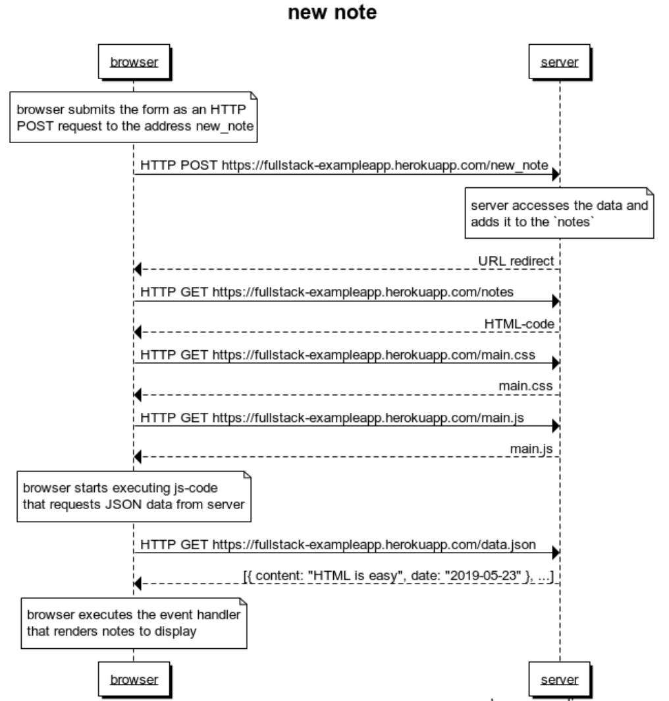
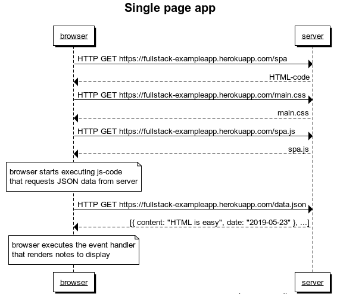
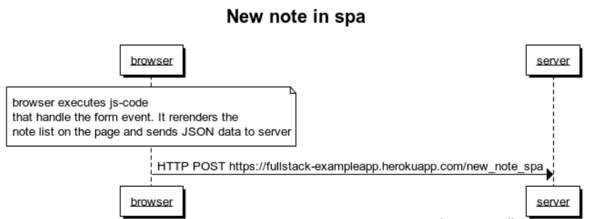

0.4: new note



```
title new note

note over browser:
 browser submits the form as an HTTP
 POST request to the address new_note
end note

browser->server: HTTP POST https://fullstack-exampleapp.herokuapp.com/new_note
note over server:
server accesses the data and
adds it to the `notes` 
end note
server-->browser: URL redirect
browser->server: HTTP GET https://fullstack-exampleapp.herokuapp.com/notes
server-->browser: HTML-code
browser->server: HTTP GET https://fullstack-exampleapp.herokuapp.com/main.css
server-->browser: main.css
browser->server: HTTP GET https://fullstack-exampleapp.herokuapp.com/main.js
server-->browser: main.js

note over browser:
browser starts executing js-code
that requests JSON data from server 
end note

browser->server: HTTP GET https://fullstack-exampleapp.herokuapp.com/data.json
server-->browser: [{ content: "HTML is easy", date: "2019-05-23" }, ...]

note over browser:
browser executes the event handler
that renders notes to display
end note
```

0.5: Single page app



```
title Single page app

browser->server: HTTP GET https://fullstack-exampleapp.herokuapp.com/spa
server-->browser: HTML-code
browser->server: HTTP GET https://fullstack-exampleapp.herokuapp.com/main.css
server-->browser: main.css
browser->server: HTTP GET https://fullstack-exampleapp.herokuapp.com/spa.js
server-->browser: spa.js

note over browser:
browser starts executing js-code
that requests JSON data from server 
end note

browser->server: HTTP GET https://fullstack-exampleapp.herokuapp.com/data.json
server-->browser: [{ content: "HTML is easy", date: "2019-05-23" }, ...]

note over browser:
browser executes the event handler
that renders notes to display
end note
```

0.6: New note



```
title New note in spa

note over browser:
browser executes js-code
that handle the form event. It rerenders the 
note list on the page and sends JSON data to server 
end note

browser->server: HTTP POST https://fullstack-exampleapp.herokuapp.com/new_note_spa
```